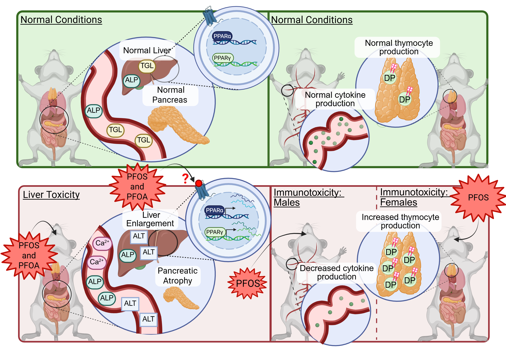

# PFOS and PFOA Exposure Induces Liver Injury and Sex-Dependent Immune Effects in C57BL/6 Mice 
## Authors
Amélie Blais, Allison Loan, Eunnara Cho, Asia Woodtke, Houman Moteshareie, Lauren M. Bradford, Gong Zhang, Guillaume Pelletier, Martha Navarro, Matthew J. Meier, Andy Nong, Rocio Aranda-Rodriguez, Kristin M. Eccles, David Prescott, Azam Tayabali

## Abstract
Per- and polyfluoroalkyl substances (PFAS) are persistent environmental contaminants known as “forever chemicals.” Perfluorooctanoic acid (PFOA) and perfluorooctanesulfonic acid (PFOS), representing carboxylate and sulfonate subclasses, are among the most frequently detected PFAS in biomonitoring studies. We characterized the hepatotoxicity and immunotoxicity of PFOS and PFOA in male and female C57BL/6-Elite mice exposed via oral gavage for 28 (1.5 mg/kg/day) or 56 days (0.166–1.5 mg/kg/day). Both compounds caused pancreatic atrophy, hepatomegaly, elevated serum biomarkers of liver injury, and decreased serum triglyceride levels across sexes and exposure durations. Liver transcriptomics revealed enrichment of PPAR signaling, lipid metabolism disruption, and AGE-RAGE pathways. Immunotoxicity assessments showed PFOS-induced cytokine suppression (IL-4, IL-17α, TNF-α, MCP-1) in males, while females exhibited minimal cytokine changes but altered thymocyte development. Overall, PFAS caused sex-independent hepatic and pancreatic toxicity but sex-dependent immune effects. Limitations include asymmetric dosing and lack of estrous monitoring; future studies should integrate histopathology and gene expression confirmatory analysis. 

## Graphical Abstract

## Processing Notebooks
All data processing, cleaning, and preprocessing notebooks are located in the Processing_Notebooks folder

## Paper
Blais A, Loan A, Cho E, Woodtke A, Moteshareie H, Bradford LM, Zhang G, Pelletier G, Navarro M, Meier MJ, Nong A, Aranda-Rodriguez R, Eccles KM, Prescott D, Tayabali AF. PFOS and PFOA exposure induces liver injury and sex-dependent immune effects in C57BL/6 mice. iScience. 2026 Jan 14;29(2):114693. doi: 10.1016/j.isci.2026.114693. PMID: 41641100; PMCID: PMC12865548.